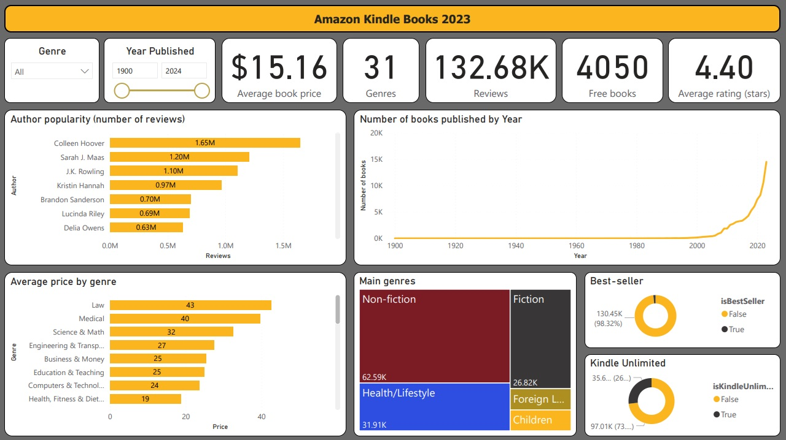

# Project overview
This project contains a dashboard providing insights into over 130 000 Kindle books that were available on Amazon in 2023. Dashboard contains key metrics, most popular authors and genres, year of publication chart and more.

The dataset was initially cleaned in Python and then additional changes were made in PowerQuery (like grouping genres, changing data types etc.)

The data used for this project was taken from kaggle (The dataset used for this project is taken from Kaggle (https://www.kaggle.com/datasets/asaniczka/amazon-kindle-books-dataset-2023-130k-books).

# Dashboard contents
### **Genre and Publication Year slicers**:
- Slicers used to choose a genre of interest and a specific period of time when the books were published.
### **Key metrics**:
- Key metrics showcasing average book price, number of genres, total number of reviews, number of free Kindle books available on Amazon and average book rating.
### **Bar charts**:
- Bar chart showing the most popular authors (by a number of reviews of their books)
  - Contains drill down option to see the popularity of the author genres and then singular books.
- Bar chart showing average price of books from various genres
  - Contains drill down option to see average price of books written by an author in a specific genre.
### **Line chart of book publication year**:
- A line chart showing publication years of books available on Kindle.
### **Treemap of main genres**
- Treemap displaying main book genres
### **Donut charts**:
- Donut charts showing a share of books that are best-sellers and books that are available in Kindle Unlimited service.
